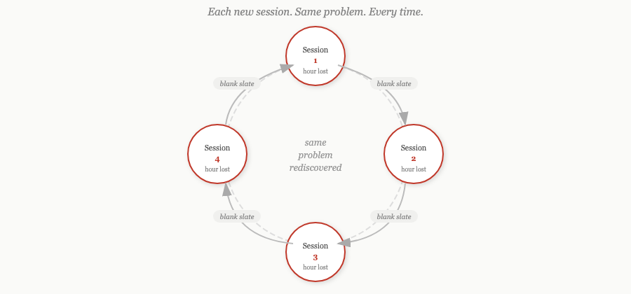
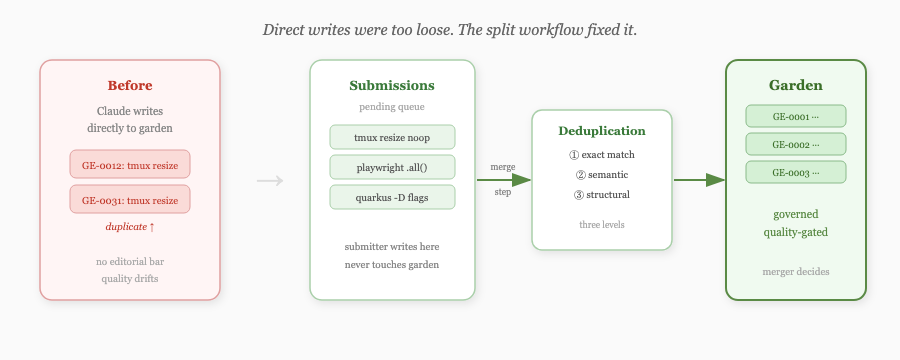
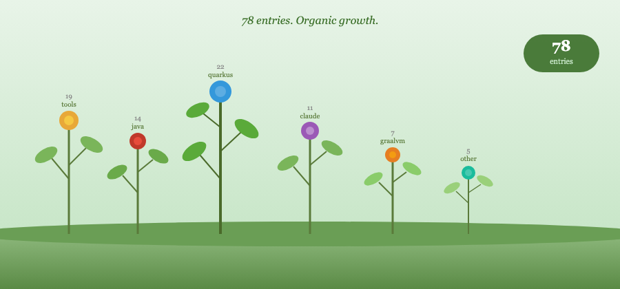
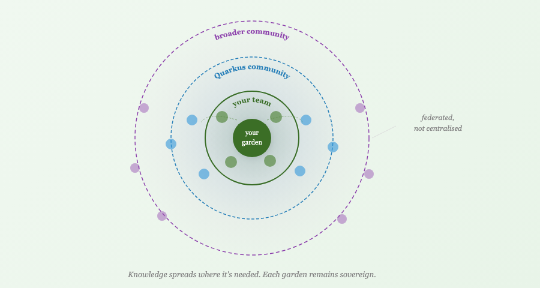

# The Rootstock: How the Hortora Garden was Germinated

I kept losing hours.

Not to bad code or wrong decisions — to rediscovery. A Claude session would go in circles on something I'd solved in a different session. Each new context window was a blank slate. What Claude learned in one session didn't survive to the next.

The fix seemed obvious: capture the hard-won stuff before context closes, make it findable next time.

## The garden skill

I built a capture skill for Claude Code. Five categories: gotchas (bugs whose symptoms mislead about root cause), techniques (non-obvious approaches that worked), undocumented behaviour, workarounds, and patterns worth naming. The first version wrote entries directly — Claude would note something worth capturing and write it into a domain file on the spot.

That was too loose. Claude wrote the same thing twice without knowing. Domain files grew into unstructured dumps. The editorial bar was effectively zero.

So I split the workflow. Submissions go into a pending queue; a separate merge step integrates them, deduplicates at three levels — exact match, semantic similarity, and structural equivalence — and decides whether an entry is genuinely novel. The submitter doesn't touch the garden directly. The merger does, with more context and deliberate checks.

The quality improved noticeably.

## 78 entries

I ran the garden across all my active Claude projects. Entries accumulated. By 78, the pattern was clear: the knowledge held up. Claude could retrieve the right entry in three tool calls. When it did, it didn't repeat the mistake.

At 78, retrieval started showing strain. And I could see where this was going — if this was going to work for my team, and eventually for the broader Quarkus community, it needed proper architecture before the debt made it painful.

## A name

Before the design session I realised this needed a name. Several good candidates were taken. Cairn was an active AI coding agent. Mycelium was a live orchestrator in exactly the same space. Grok suggested Sylvara as its top pick — Claude ran independent searches and found sylvara.ai is a live AI agency. Grok didn't know.

Hortora came from *hortus*, Latin for garden, with an ending that hints at oracle. A garden you tend, an oracle you consult.

That felt right. We bought the domains, created the org, and started the design session.

