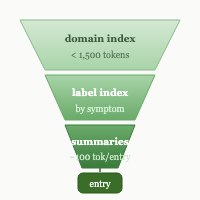
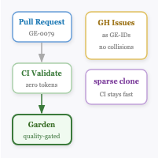
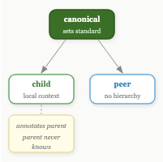
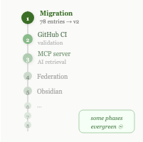

# The Session: One Fix, One Afternoon, One Project

I came in to fix retrieval. We fixed it in an hour.

One file per entry instead of grouped domain files. A three-tier algorithm: if you know the technology, grep the domain index — under 1,500 tokens. If you know the symptom, check the label index. If you're genuinely lost, scan all summaries — bounded at roughly 30,000 tokens for 300 entries, regardless of garden size. A `_summaries/` layer at ~100 tokens per entry sits between the index and the full content. Claude reaches the right entry in three tool calls.

Then we didn't stop.

## The GitHub backend

The obvious next question: where does the garden live, and how do entries get reviewed? GitHub Issues as GE-IDs solved the concurrent-PR counter collision problem — two people submitting entries simultaneously can't create duplicate IDs. Sparse blobless clones keep the CI fast. GitHub Actions validate every PR before anything touches the garden — zero-token cost, no Claude involvement in the quality gate.

## Federation

The team case forced the federation model. If someone on my team runs their own garden, how does knowledge flow between us without centralising everything?

Three relationship types emerged: canonical gardens set the editorial standard for a domain; child gardens enrich canonical entries with local context the parent never sees; peer gardens share entries across domains without hierarchy. A child can annotate a parent entry — "this applies differently in our setup" — without submitting a change upstream.

The Quarkus case made it concrete. A community Quarkus garden could sit alongside individual team gardens, all federated, each sovereign.

## Nine phases

The roadmap came out of asking how far this could go. Nine phases, some explicitly labelled evergreen — never finished, just tended. Phase 1 is migration: 78 entries, v2 structure, one file each. Everything after that builds on a working foundation.

 

## The spec

The document is 3,300 lines with 10 embedded diagrams. It exists. The garden doesn't yet.

Phase 1 is next.
